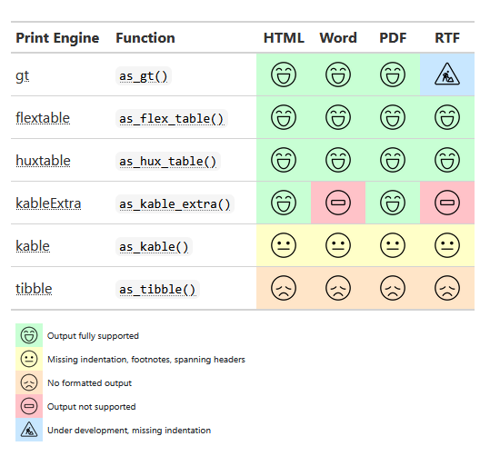
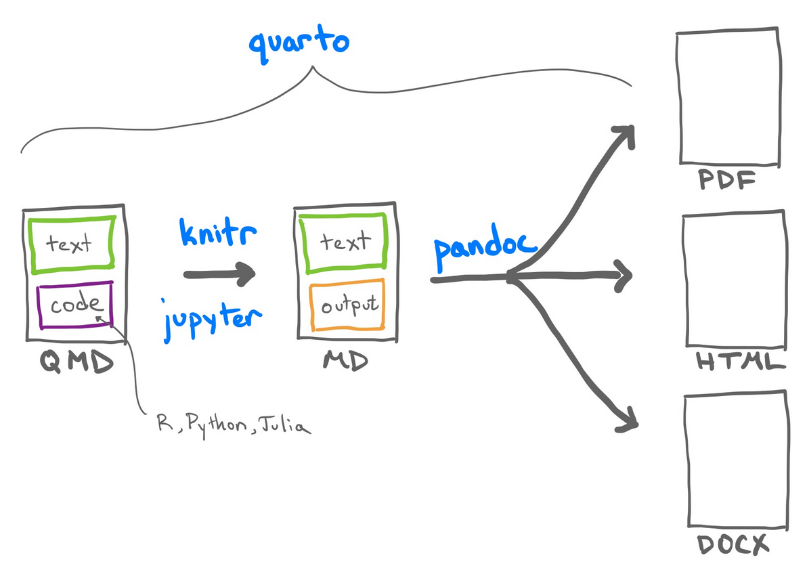
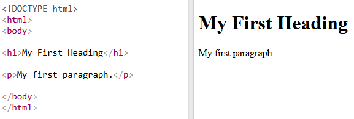
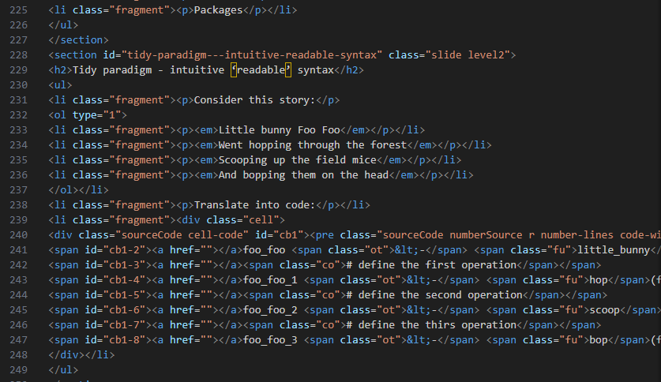
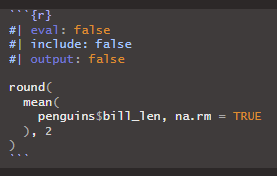
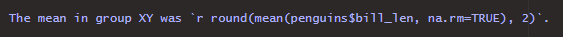
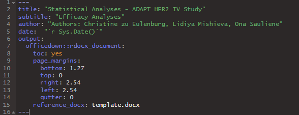
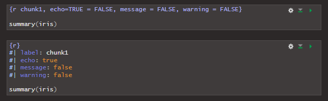
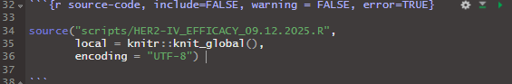
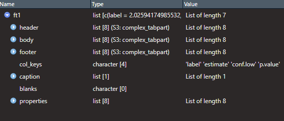

## Intro

-   Day 1: basic syntax, classes, objects, functions

-   Day 2: base package, tidy programming & tidyverse

-   **Day 3:**

    -   **Part 1: Summarizing data / tables**

    -   **Part 2: Reporting with RMarkdown / Quarto**

-   Day 4: Git & RStudio

-   *Still missing: further operations on vectors. graphs, referencing in rmd/qmd, citations and bibliography*

## Recap last week

::: incremental
-   tidy paradigm

-   working with data using base and tidyverse packages

-   import and export, subsetting and filtering, rlong/wide format, variable transformations
:::

## Part 1

## Summarizing data

::: incremental
-   `table()`

    ```{r}
    #| echo: true
    table(penguins$species, penguins$island)
    ```

-   `prop.table()`

    ```{r}
    #| echo: true
    prop.table(table(penguins$species, penguins$island), margin = NULL) # margin=1 for rows, margin=2 for columns
    ```

-   `addmargins()`

    ```{r}
    #| echo: true
    addmargins(prop.table(table(penguins$species, penguins$island), margin = NULL)) # margin=1 for rows, margin=2 for columns
    ```
:::

## Summarizing data

. . .

```{r}
#| echo: true
table(penguins$species, penguins$island, penguins$sex)
```

## Summarizing data

::: incremental
-   `summary()`

    ```{r}
    #| echo: true
    summary(penguins$bill_len, useNA="always")
    ```

-   can be used as a general method to get a summary of different model outputs

-   can be used to get a summary of an entire dataset

    ```{r}
    #| echo: true
    summary(penguins, useNA="always")
    ```
:::

## Summarizing data

. . .

-   dplyr package: `group_by()` and `summarize()`

. . .

```{r}
#| include: false
library(dplyr)
library(tidyr)
```

. . .

```{r}
#| echo: true
penguins %>%
  group_by(island) %>%
  summarise(mean_bill_len = mean(bill_len, na.rm=TRUE))
```

. . .

```{r}
#| echo: true
penguins %>%
  select(-c(year)) %>%
  drop_na() %>%
  group_by(island, sex) %>%
  summarise(across(where(is.numeric), mean))
```

## Summary tables for reports

::: incremental
-   many different (not very practical) ways for producing summary tables

    -   check out this guide:

        <https://cran.r-project.org/web/packages/DescTools/vignettes/TablesInR.pdf>

-   dataframe is a table and can be used always as such

    ```{r}
    #| echo: true
    kableExtra::kable(penguins[1:4, ])
    ```
:::

## Summary tables for reports

::: incremental
-   programming and formatting usually with different packages

-   `gtsummary` package for programming (unless it is a very specific table)

-   package for formatting depends on the output file

    {fig-align="left" width="423"}
:::

## Tables with gtsummary

-   summary tables from dataframes/tibbles

-   regression tables from model outputs

-   merging and stacking of tables

-   some features for customization

## Tables with gtsummary - descriptives

```{r}
#| echo: false
#| output: true

# example datasets for different types of medical data
library(medicaldata)

# creating tables
library(gtsummary)


indo_rct %>% 
  # filter the columns of the dataset
  select(c("rx", "age", "risk", "type")) %>%
  # select(c(rx, age, risk, type)) %>% # also works here!
  
  # recode the labels of the treatment variable rx
  # factor is a character vector, that allows labeling and ordering
  mutate(rx = factor(
    rx,
    levels = c("1_indomethacin", "0_placebo"),
    labels = c("Indometh", "Placebo"))
    ) %>%
  
  # specify a summary table
  tbl_summary(
    
    # stratification by treatment
    by = rx,
    
    # you can also use the include argument instead of selecting before
    # include = c("rx", "age", "risk", "type"),
    
    # provide labels to the variables
    label = list(
      age ~ "Age",
      risk ~ "Risk"
      # ...
    ),
    
    # whether to report the number of missing values
    # default is missing="ifany"
    missing = "always",
    missing_text = "Missing",
    
    # define statistics to be reported
    statistic = list(
      all_continuous() ~ "{median} ({p25}, {p75})",
      all_categorical() ~ "{n} ({p}%)",
      risk ~ c("{median} ({p25}, {p75})", "{min}, {max}")),
    
    # continuous2 allows for multi-line statistics
    type = list(risk ~ "continuous2")
    
    ) %>%
  
  # add the total column
  add_overall(last=TRUE) %>%
  
  # perform tests
  add_p(
    # you can also define the test separately for each variable
    test = list(all_continuous() ~ "t.test",
                all_categorical() ~ "chisq.test"),
    test.args = list(all_tests("t.test") ~ list(var.equal = TRUE))) %>%
  
  # print the p-value in bold if below a threshhold
  bold_p(t=0.05) %>%
  
  # render variable names in bold
  bold_labels() %>%
  
  # update the header
  modify_header(label = "**Variable**") %>%
  modify_header(all_stat_cols() ~ "**{level}**, N = {n} ({style_percent(p)}%)") %>%
  modify_spanning_header(all_stat_cols() ~ "**Treatment Received**")
```

## Tables with gtsummary - descriptives

```{r}
#| echo: true
#| output: false

# example datasets for different types of medical data
library(medicaldata)

# creating tables
library(gtsummary)


indo_rct %>% 
  # filter the columns of the dataset
  select(c("rx", "age", "risk", "type")) %>%
  # select(c(rx, age, risk, type)) %>% # also works here!
  
  # recode the labels of the treatment variable rx
  # factor is a character vector, that allows labeling and ordering
  mutate(rx = factor(
    rx,
    levels = c("1_indomethacin", "0_placebo"),
    labels = c("Indometh", "Placebo"))
    ) %>%
  
  # specify a summary table
  tbl_summary(
    
    # stratification by treatment
    by = rx,
    
    # you can also use the include argument instead of selecting before
    # include = c("rx", "age", "risk", "type"),
    
    # provide labels to the variables
    label = list(
      age ~ "Age",
      risk ~ "Risk"
      # ...
    ),
    
    # whether to report the number of missing values
    # default is missing="ifany"
    missing = "always",
    missing_text = "Missing",
    
    # define statistics to be reported
    statistic = list(
      all_continuous() ~ "{median} ({p25}, {p75})",
      all_categorical() ~ "{n} ({p}%)",
      risk ~ c("{median} ({p25}, {p75})", "{min}, {max}")),
    
    # continuous2 allows for multi-line statistics
    type = list(risk ~ "continuous2")
    
    ) %>%
  
  # add the total column
  add_overall(last=TRUE) %>%
  
  # perform tests
  add_p(
    # you can also define the test separately for each variable
    test = list(all_continuous() ~ "t.test",
                all_categorical() ~ "chisq.test"),
    test.args = list(all_tests("t.test") ~ list(var.equal = TRUE))) %>%
  
  # print the p-value in bold if below a threshhold
  bold_p(t=0.05) %>%
  
  # render variable names in bold
  bold_labels() %>%
  
  # update the header
  modify_header(label = "**Variable**") %>%
  modify_header(all_stat_cols() ~ "**{level}**, N = {n} ({style_percent(p)}%)") %>%
  modify_spanning_header(all_stat_cols() ~ "**Treatment Received**")
```

## Tables with gtsummary - survival data

```{r}
#| echo: false
#| output: true

library(survival)

# survival
tbl_survfit(
  # compute survival curves 
  survfit(
    Surv(ttdeath, death) ~ trt, trial
    # default is kaplan-meier
    # type=c("kaplan-meier","fleming-harrington", "fh2")
  ),
  
  # specify timepoints for estimating survival probabilities
  times = c(6, 12, 18, 24),
  
  # change the header label
  label_header = "**{time} Month**"
  ) %>%
  
  # render variable names in bold
  bold_labels() %>%
  
  # add log-rank test
  add_p() %>%
  
  # print the p-value in bold if below a threshhold
  bold_p() %>%
  
  # some other header label modifications
  modify_header(label = "**Variable**") %>%
  modify_spanning_header(all_stat_cols() ~ "**Survival**")
```

## Tables with gtsummary - survival data

```{r}
#| echo: true
#| output: false

library(survival)

# survival
tbl_survfit(
  # compute survival curves 
  survfit(
    Surv(ttdeath, death) ~ trt, trial
    # default is kaplan-meier
    # type=c("kaplan-meier","fleming-harrington", "fh2")
  ),
  
  # specify timepoints for estimating survival probabilities
  times = c(6, 12, 18, 24),
  
  # change the header label
  label_header = "**{time} Month**"
  ) %>%
  
  # render variable names in bold
  bold_labels() %>%
  
  # add log-rank test
  add_p() %>%
  
  # print the p-value in bold if below a threshhold
  bold_p() %>%
  
  # some other header label modifications
  modify_header(label = "**Variable**") %>%
  modify_spanning_header(all_stat_cols() ~ "**Survival**")
```

## Tables with gtsummary - regression tables

```{r}
#| echo: false
#| output: true

# specify a logistic model
mod1 <- glm(response ~ trt + age + grade, trial, family = binomial)
# build a regression table
t1 <- tbl_regression(mod1, exponentiate = TRUE)

# specify a cox model
mod2 <- coxph(Surv(ttdeath, death) ~ trt + grade + age, trial)
# build a regression table
t2 <-  tbl_regression(mod2, exponentiate = TRUE)

# merge tables
t3 <- tbl_merge(
  tbls = list(t1, t2),
  tab_spanner = c("**Tumor Response**", "**Time to Death**")
  )

```

## Tables with gtsummary - regression tables

```{r}
#| echo: false
#| output: true
t1
```

## Tables with gtsummary - regression tables

```{r}
#| echo: false
#| output: true
t2
```

## Tables with gtsummary - regression tables

```{r}
#| echo: false
#| output: true
t3
```

## Tables with gtsummary - regression tables

```{r}
#| echo: true
#| output: false

# specify a logistic model
mod1 <- glm(response ~ trt + age + grade, trial, family = binomial)
# build a regression table
t1 <- tbl_regression(mod1, exponentiate = TRUE)

# specify a cox model
mod2 <- coxph(Surv(ttdeath, death) ~ trt + grade + age, trial)
# build a regression table
t2 <-  tbl_regression(mod2, exponentiate = TRUE)

# merge tables
t3 <- tbl_merge(
  tbls = list(t1, t2),
  tab_spanner = c("**Tumor Response**", "**Time to Death**")
  )

t1
t2
t3
```

## Tables with gtsummary - regression tables

```{r}
#| echo: true

# table containing a set of univariable regressions
tbl_uvregression(
  trial,
  method = coxph,
  y = Surv(ttdeath, death),
  exponentiate = TRUE,
  include = c("age", "grade", "response"),
  pvalue_fun = label_style_pvalue(digits = 2)
)
```

## Part 2

## Reporting with RStudio

. . .

{fig-align="left" width="598"}

## A quarto document

. . .

{fig-align="left" width="597"}

## Markup languages

::: incremental
-   text-encoding systems that specifiy the structure & formatting of a document

-   well-known examples: TeX, HTML, XML ...

-   combine plain text & code used for formatting

-   markdown (md) is a simplified markup language that uses minimal code
:::

## Markup languages - HTML example

. . .

::: {layout-ncol="2"}



:::

## Markdown basics

## Markdown basics - text

. . .

+-----------------------------------------+-----------------------------------------+
| **Markdown Syntax**                     | **Output**                              |
+=========================================+=========================================+
|                                         |                                         |
+-----------------------------------------+-----------------------------------------+
| ```                                     | *italics*, **bold**, ***bold italics*** |
| *italics*, **bold**, ***bold italics*** |                                         |
| ```                                     |                                         |
+-----------------------------------------+-----------------------------------------+
| ```                                     | superscript^2^ / subscript~2~           |
| superscript^2^ / subscript~2~           |                                         |
| ```                                     |                                         |
+-----------------------------------------+-----------------------------------------+
| ```                                     | ~~strikethrough~~                       |
| ~~strikethrough~~                       |                                         |
| ```                                     |                                         |
+-----------------------------------------+-----------------------------------------+
| ```                                     | `verbatim code`                         |
| `verbatim code`                         |                                         |
| ```                                     |                                         |
+-----------------------------------------+-----------------------------------------+

## Markdown basics - headings

. . .

+---------------------+-----------------------------------+
| **Markdown syntax** | **Output**                        |
+---------------------+-----------------------------------+
|                     |                                   |
+---------------------+-----------------------------------+
| ```                 | # Heading 1                       |
| # Heading 1         |                                   |
| ```                 |                                   |
+---------------------+-----------------------------------+
| ```                 | ## Heading 2                      |
| ## Heading 2        |                                   |
| ```                 |                                   |
+---------------------+-----------------------------------+
| ```                 | ### Heading 3                     |
| ### Heading 3       |                                   |
| ```                 |                                   |
+---------------------+-----------------------------------+
| ```                 | #### Heading 4                    |
| #### Heading 4      |                                   |
| ```                 |                                   |
+---------------------+-----------------------------------+

## Markdown basics - footnotes

. . .

-   Footnote reference

. . .

```         
Here is a footnote reference[^1].

[^1]: Here is the footnote.  
```

. . .

-   Inline note

. . .

```         
Here is an inline note.^[Inlines notes are easier to write, since you don't have to pick an identifier and move down to type the note.]
```

## Markdown basics - inserting images

. . .

```         
{fig-align="left"}
```

. . .

{fig-align="left" width="598"}

## Markdown basics

-   There are many more formatting options such as formatting tables and diagrams, adding page breaks etc.

-   Checkout the quarto website for details:

    -   <https://quarto.org/docs/authoring/markdown-basics.html>

## Maths using TeX

. . .

**(1) inline maths**

. . .

```         
In simple linear regression, the model is $y = \beta_0 + \beta_1 x + \varepsilon$. 
```

. . .

In simple linear regression, the model is $y = \beta_0 + \beta_1 x + \varepsilon$.

. . .

**(2) standalone equation**

. . .

```         
In simple linear regression, the model is

$$
\begin{equation}
y = \beta_0 + \beta_1 x + \varepsilon.
\end{equation}
$$
```

. . .

In simple linear regression, the model is

$$
\begin{equation}
y = \beta_0 + \beta_1 x + \varepsilon.
\end{equation}
$$

. . .

Cheatsheet: <https://tug.ctan.org/info/undergradmath/undergradmath.pdf>

## Adding code to RMD / QMD

::: incremental
-   **Option 1**: code chunk

    -   {width="350"}

        ```{r}
        #| eval: false
        #| include: false
        #| output: false

        round(
          mean(
            penguins$bill_len, na.rm = TRUE
          ), 2
        )
        ```

-   **Option 2**: inline code

    -   Add output of the code within text

        -   {width="700"}

        -   The mean in group XY was `r round(mean(penguins$bill_len, na.rm=TRUE), 2)`.
:::

## YAML - Yet Another Markup Language

::: incremental
-   In Quarto it is used for overall document configuration

-   A YAML section is placed in the beginning of the document

    -   {width="449"}

-   A code chunk can also contain a YAML section

    -   {width="514"}
:::

## Code chunks - execution options

. . .

+-----------------+---------------------------------------+
| **Option**      | **Description**                       |
+-----------------+---------------------------------------+
|                 |                                       |
+-----------------+---------------------------------------+
| `eval: true`    | whether to evaluate the code          |
+-----------------+---------------------------------------+
| `echo: true`    | whether to show the code              |
+-----------------+---------------------------------------+
| `include: true` | whether to include the code           |
+-----------------+---------------------------------------+
| `cache: true`   | whether to cache the resutls          |
+-----------------+---------------------------------------+

## Code chunks - figure control

. . .

+------------------------+---------------------------------------+
| **Option**             | **Description**                       |
+------------------------+---------------------------------------+
|                        |                                       |
+------------------------+---------------------------------------+
| `fig-cap: "My figure"` | figure caption                        |
+------------------------+---------------------------------------+
| `fig-width: 8`         | whether to show the code              |
+------------------------+---------------------------------------+
| `fig-height: 6`        | width in inches                       |
+------------------------+---------------------------------------+
| `fig-align: "center"`  | height in inches                      |
+------------------------+---------------------------------------+
| `fig-dpi: 300`         | resolution                            |
+------------------------+---------------------------------------+
| `out-width: "80%"`     | output width                          |
+------------------------+---------------------------------------+
| `layout-ncol: 2`       | number of columns for plots           |
+------------------------+---------------------------------------+

## Code chunks - output control

. . .

+------------------+---------------------------------------+
| **Option**       | **Description**                       |
+------------------+---------------------------------------+
|                  |                                       |
+------------------+---------------------------------------+
| `warning: false` | hide warnings                         |
+------------------+---------------------------------------+
| `message: false` | hide messages                         |
+------------------+---------------------------------------+
| `error: false`   | hide error messages                   |
+------------------+---------------------------------------+
| `output: false`  | hide all output                       |
+------------------+---------------------------------------+

## Sourcing code

::: incremental
-   **Option 1:** put all code into the code chunks or inline code

-   **Option 2:** source your code from an external script

-   You can do both (use results produced by the sourced code in the code chunks or inline code)

-   {width="700"}
:::

## Rendering tables

. . .

{fig-align="left"}

## Rendering tables - flextable

::: incremental
-   A package for creating and formatting tables

-   Own class: flextable

-   You can transform a gtsummary object to a flextable object

    -   Add additional formatting

        -   check out this webpage: <https://ardata-fr.github.io/flextable-book/index.html>

    -   Else the format of gtsummary table is taken over to a flextable object

    -   You can export it to .docx

-   
:::

## Flextable to docx - fitting to page

. . .

```{r}
#| echo: true
#| output: false

# ============================================================
# Fit a flextable to a LANDSCAPE page
# ============================================================

FitFlextableToPageLanscape <- function(
  
  # select a flextable object
  ft,
  
  # usable page width in inches:
  # A4 landscape width (29.7 cm) 
  # minus 5 cm margins, converted to inches
  pgwidth = (29.7 - 5) / 2.54) {

  # apply consistent formatting
  ft_out <- ft %>%
    fontsize(size = 9, part = "body") %>%     # body text size
    fontsize(size = 10, part = "header") %>%  # header text size
    autofit() %>%                             # initial auto column widths
    height_all(0.25, part = "body") %>%       # compact row height
    hrule(rule = "exact", part = "body")      # fixed row height (vs auto)

  # rescale column widths to exactly fill the available page width
  ft_out <- width(
    ft_out,
    width = dim(ft_out)$widths * pgwidth / flextable_dim(ft_out)$widths
  )

  return(ft_out)
}

# ============================================================
# Fit a flextable to a PORTRAIT page
# ============================================================

FitFlextableToPagePortrait <- function(
    
  # select a flextable object
  ft,
  
  # usable page width in inches:
  # A4 portrait width (21 cm)
  # minus 5 cm margins, converted to inches
  pgwidth = (21 - 5) / 2.54) {

  # apply consistent formatting
  ft_out <- ft %>%
    fontsize(size = 9, part = "body") %>%     # body text size
    fontsize(size = 10, part = "header") %>%  # header text size
    autofit() %>%                             # initial auto column widths
    height_all(0.25, part = "body") %>%       # compact row height
    hrule(rule = "exact", part = "body")      # fixed row height 

  # rescale column widths to exactly fill the available page width
  ft_out <- width(
    ft_out,
    width = dim(ft_out)$widths * pgwidth / flextable_dim(ft_out)$widths
  )

  return(ft_out)
}

```

## Gtsummary to flextable to docx - workflow

. . .

```{r}
#| echo: true
#| eval: false

# specify a logistic model
mod1 <- glm(response ~ trt + age + grade, trial, family = binomial)

# build a regression table
t1 <- tbl_regression(mod1, exponentiate = TRUE)

# transform to a flextable object and fit to page
FitFlextableToPageLandscape(as_flex_table(t1))
```

## Debugging with RMD/QMD

::: incremental
-   Generally more difficult to debug code in RMarkdown/Quarto

    -   Errors are indicated in the output windows of the code chunks

    -   When rendering the document, RMD/QMD will just stop in case of error

    -   To debug, you need to run each code chunk separately (considering the order!)

-   In a script, debugging is more straight forward, an an error will be shown in the console directly after the corresponding code line

-   RMD/QMD will not render, if the sourced Rscript contains errors
:::

## Reporting with RStudio - example file

## The end

{fig-align="left"}

## Move to the next session

## Further operations on vectors

-   sum, length, which

## Graphs

-   base R plots

-   bese plots into pane with par(mfrow = c(2,2)) and dev.off()

-   ggplot concept

-   arranging plots with ggplot

-   plots from models

## Referencing with RMD/QMD

## Citations and bibliography with RMD/QMD
